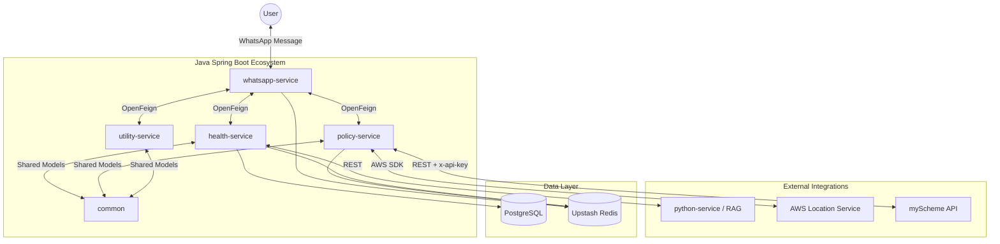

# 🏥 WhatsApp HealthBot: AI-Powered Medical & Policy Assistant

A sophisticated, location-aware microservices application built with **Spring Boot 3.4** and **Java 21**. This chatbot integrates AI-driven diagnostics (RAG), real-time government health scheme retrieval, and multilingual support to provide accessible healthcare information via WhatsApp.

---

## 🏗️ System Architecture

The project follows a **Microservices Architecture** using Spring Cloud for inter-service communication and a Python-based RAG service for medical intelligence.



---

## 📂 Project Structure & Services

### 1. `whatsapp-service` (Port 8080)
The gateway of the application. It handles the webhooks from the **Meta WhatsApp Business API**.
- **Role:** Message routing and response delivery.
- **Key Features:** Uses `MessageRouter` to decide whether a user needs medical advice (Health) or government schemes (Policy).

### 2. `health-service` (Port 8081)
The core logic engine for medical inquiries.
- **Role:** Handles disease information, symptoms, and user sessions.
- **Key Features:** Integrates with the **Python RAG service** to provide AI-generated insights based on clinical datasets.
- **Database:** The only service with direct access to the PostgreSQL database.

### 3. `policy-service` (Port 8082)
A location-aware service for government health benefits.
- **Role:** Fetches live schemes from the official **myScheme.gov.in** portal.
- **Key Features:**
    - Resolves user city names to states using **AWS Location Service**.
    - Fetches state-specific and central health schemes via the myScheme API.
    - Implements **Redis Caching** with a 24-hour TTL for performance.

### 4. `utility-service` (Port 8083)
Helper microservice for shared utilities.
- **Role:** Primarily handles translation services (English/Hindi) to ensure accessibility for all users.

### 5. `common`
A shared library module used by all Spring Boot services.
- **Role:** Contains shared POJOs, Feign client interfaces, and standard repository definitions to ensure consistency across the codebase.

### 6. `python-service`
A dedicated AI service running a **RAG (Retrieval-Augmented Generation)** pipeline.
- **Role:** Processes medical queries using **Ollama (Llama 3)** and a vector database containing clinical documentation.

---

## 🛠️ Technology Stack

| Category | Technology |
| :--- | :--- |
| **Backend** | Java 21, Spring Boot 3.4.3, Spring Cloud OpenFeign |
| **AI / ML** | Python 3.10+, Ollama (Llama 3.2), LangChain |
| **Databases** | PostgreSQL, Upstash Redis (Cloud) |
| **Cloud Services** | AWS Location Service, Meta WhatsApp API |
| **External APIs** | myScheme API (GoI), Google Gemini (Fallback) |
| **Build Tool** | Maven |

---

## 🚀 Getting Started

### Prerequisites
- JDK 21
- Maven 3.9+
- Docker (for local Postgres/Redis) or Cloud credentials (Upstash/AWS)
- Ollama running locally with `llama3.2` and `nomic-embed-text`

### Installation
1. **Clone the repository:**
   ```bash
   git clone <repo-url>
   ```
2. **Configuration:**
   Each service requires an `application.properties` file in `src/main/resources/`. Due to security, these are ignored by Git. Ensure you set:
   - `spring.datasource.url` (Postgres)
   - `spring.data.redis.host` (Upstash)
   - `aws.accessKeyId` & `aws.secretAccessKey`
   - `myscheme.api.key`

3. **Build the project:**
   ```bash
   mvn clean install
   ```

4. **Run Services:**
   Start the services in the following order:
   1. `common` (Install first)
   2. `health-service` & `python-service`
   3. `policy-service` & `utility-service`
   4. `whatsapp-service`

---

## 🔐 Security Note
All `application.properties` files are excluded from version control via `.gitignore` to protect sensitive API keys and database credentials. Always use environment variables or a secure vault for production deployments.
