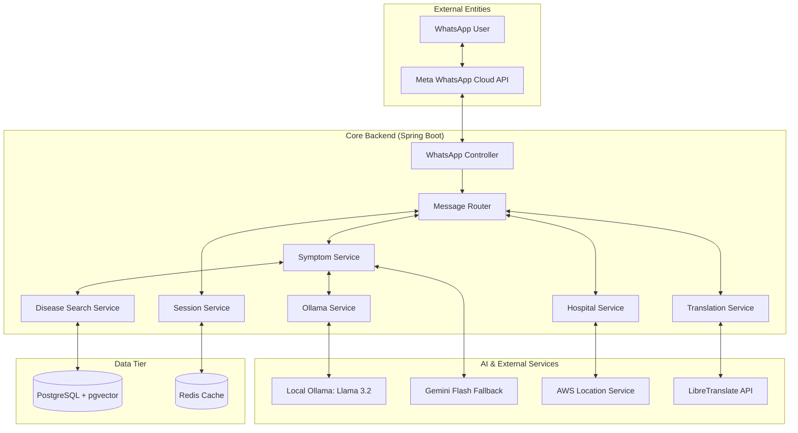

# System Architecture Report: WhatsApp HealthBot

This document outlines the architectural design, component interactions, and data flow for the WhatsApp HealthBot project.

## 1. High-Level Architecture Diagram

## 2. Component Breakdown

### 2.1 Webhook & Messaging Layer
- **WhatsAppController**: Handles incoming HTTPS POST requests from Meta's Cloud API. It performs webhook verification and routes messages asynchronously to prevent timeouts.
- **WhatsAppSender**: Formats and sends messages back to the user via Meta's REST API.

### 2.2 Orchestration Layer
- **MessageRouter**: The central "brain" of the application. It:
  - Detects user language.
  - Manages conversation state (Menu, Symptom Chat, Awaiting Location).
  - Routes requests to specific feature services (Disease Alerts, Policies, Hospitals).
  - Handles location sharing (Native & Google Maps links).

### 2.3 Intelligent Services (RAG)
- **SymptomService**: Manages the multi-turn symptom checker. It orchestrates the RAG flow by retrieving relevant medical context and feeding it to the LLM.
- **DiseaseSearchService**: Implements Vector Search. It converts user symptoms into embeddings (using nomic-embed-text) and queries **PostgreSQL (pgvector)** using cosine similarity.
- **OllamaService**: Provides a local, privacy-focused LLM interface (Llama 3.2) for processing health queries and generating embeddings.

### 2.4 Localization & Geospatial
- **TranslationService**: Uses **LibreTranslate** to provide a multilingual experience. It translates user input to English for processing and response back to the user's preferred language (e.g., Hindi).
- **HospitalService**: Integrates with **AWS Location Service** for reverse geocoding (lat/long to city) and point-of-interest search for government hospitals within a defined radius.

## 3. Data Flow: Symptom Checking (RAG)

1.  **User Message**: User sends "I have a sharp pain in my right side."
2.  **Translation**: System translates to English if needed.
3.  **Embedding**: `OllamaService` generates a 768-dim vector for the query.
4.  **Vector Search**: `DiseaseSearchService` queries `disease_embeddings` table in PostgreSQL.
5.  **Context Injection**: Top 3 matching diseases (e.g., Appendicitis, Gallstones) are injected into the LLM system prompt.
6.  **LLM Generation**: Ollama (Llama 3.2) generates a medical-grade response with a disclaimer.
7.  **Reverse Translation**: Response is translated back to the user's language.
8.  **Delivery**: Response sent via WhatsApp.

## 4. Technology Stack Summary

| Layer | Technology |
| :--- | :--- |
| **Backend Framework** | Spring Boot 3.x (Java 17) |
| **Database** | PostgreSQL + pgvector (Vector Storage) |
| **Caching/Session** | Redis |
| **Local LLM Engine** | Ollama (Llama 3.2, nomic-embed-text) |
| **Cloud LLM (Fallback)**| Google Gemini 1.5 Flash |
| **Messaging** | Meta WhatsApp Cloud API |
| **Geospatial** | AWS Location Service |
| **Translation** | LibreTranslate |
| **Build Tool** | Maven |

## 5. Deployment Architecture

The system is designed to run in a hybrid environment:
- **Core Backend**: Can be containerized (Docker) and deployed on Kubernetes/AWS.
- **Ollama**: Requires GPU-enabled infrastructure or a dedicated local server for performant LLM inference.
- **Database**: Managed PostgreSQL instance with `vector` extension enabled.
